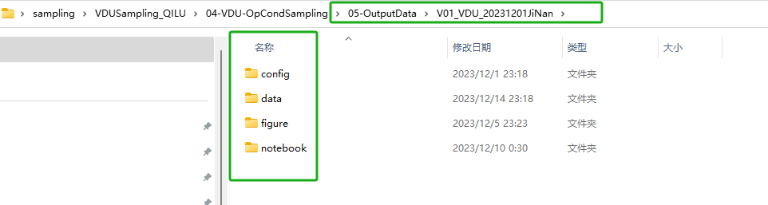
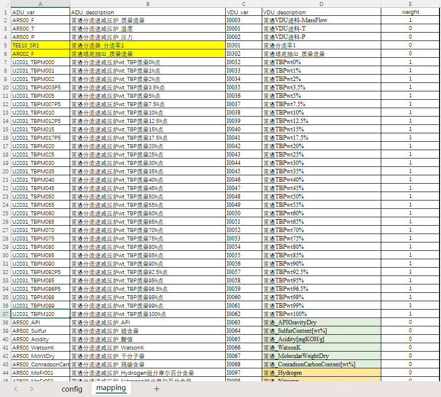

- **把复杂的工作流程用自动化的、不易出错的脚本来代替**
	- 集成环境
	- 直接看结果
- **Jupyter Notebook将Python的交互式特点发挥到了极致**
	- [[#green]]^^分析和建模^^是非常#碎片化 的工作，而每一块的碎片又有着非常强的独立性，甚至可以说除了数据本身之外，每一块的代码之间并没有很强的关联性。
	- [[#green]]^^数据分析和处理^^的过程往往是一个不断试验的过程，我们需要一次又一次的改变预处理的方式、尝试不同的特征工程处理、一遍又一遍的调整着模型参数等等等等。
	- 每一部分的工作都需要反复试验反复修改，而下一模块需要用到的只不过是上一模块输出的数据。
	- *在Jupyter当中，我们可以每写几行或者每完成一个小的模块便运行一次；通过Jupyter，我们可以最快的得知自己做出的调整是好还是坏，并尽快进入到下一次的试验当中。*
	  background-color:: blue
- **Jupyter Notebook更利于汇报和教学**
	- Jupyter在工作汇报和教学方面也是非常的优秀。由于Jupyter本身的模块化和内容的清晰化，使得其天生具有如PPT一般的展示工作成果的功能。
	- 由于Jupyter中可以将输出结果嵌套在Notebook中，并且支持Markdown语句的操作，这样使得你可以在Jupyter中输入任何你需要展示的内容，并且这些内容都会以一种[[#blue]]^^有组织有层次^^的样子排列出来。
- # VDUSampling_QILU
  id:: 657919be-8286-49de-8c81-b6b0d2027443
	- ## 01-ADU Feed Sampling
		- **00-Generate Crude Property Based on Configuration.ipynb**
			- config [[配置表]]
			  id:: 6576b390-9fbf-4294-b228-b1f18a2c12f3
				- 🔍notebook中szconfigfile的设置要和自己的配置表名称及路径一致
				  🔍版本名\rightarrow在outputdata中生成不同文件夹
					- 
					  
			- crude propert 原油属性
				- refinery 样本
					- TBP curves
					- tag \leftrightarrow variable name
			- TBP conversion 定温累计收率
				- 混合规则
				- 基于收率\rightarrow基于温度
				- 非线性采样\rightarrow线性采样
			- cut point 理想收率
				- 理想馏分，连续切割
				- 估算现场切割点
			- sampling target property
				- Tag
				- varlist
				- Relaxcoef
				- formula
				- 样本数量
		- **01-Crude Sampling.ipynb**
	- ## 03-VDU Feed Sampling
		- **00-DataProcessing.ipynb**
			- objective:
			  抽样方法提取常渣进料样本
			  收率分布覆盖且吻合现场数据
			- basic principles：
			  每种原油有5~10个ADU[[$red]]==重复==样本——相同same/相似close
			  VDU与ADU方法相似
			  移除相似样本后，获得目标数量级常渣样本
			  开发了一种基于[[$red]]==加权欧氏距离==来去除重复样本的方法🔍[[标准化]]
			  所选属性包括31点TBP曲线点及API、流量等
			- 1.删除相似常渣样本数据
				- 改变fdistcriteria[distance criteria parameter]距离标准参数\rightarrow决定移除样本数量\rightarrow获取特定样本数
			- 2.比较删除前后分布变化
			- config[[配置表]]
				- mapping+描述
				- feature ID由ADU_var \rightarrow VDU_var
					- 
					  🔍这里要注意ADU_var要和常压给到的采样结果h5文件中保持一致（包括feature ID和变量总数）
					  🔍weight列表示计算距离时移除相似样本的权重——移除率由标准距离参数控制，移除后的分布则由设置的权重影响——尽量选择符合常渣特征且差异性不大的变量，如常渣流量+31个TBP点的组合，可以有效增加样本多样性
	- ## 04-VDU Operating Condition Sampling
		- ### Distop
			- **00-SimplifiedModel-Operating Condition SamplingV02.ipynb**
			  Distop 自动采样和样本改造
				- config[[配置表]]
					- VDUFeed
						- 🔍VDUFeed中的‘_com’用于样本运行时定位模型中常渣的虚拟组分
					- IndepVar
					  对[[独立变量]]进行LHS采样
						- 配置上下限——变化范围
							- 减压塔顶温度与减顶循返塔温度关联，调整两者差值以吻合现场的减顶温度分布
							  同样用来关联计算的虚拟仪表还有“减顶循抽出_质量流量/常渣塔底抽出_质量流量”
							- 常渣进料温度、塔顶压力、减顶循返塔温度、中段取热比例、减一中温差、减二中温差、减压塔塔底温度、侧线/塔底汽提分率上下限设置参考现场数据
							- 提馏段两个分流器的分流率用来调整减渣轻组分和雾沫夹带的重组分，范围参考齐鲁
							  精馏段/进料阀/转油线压降、过气化率参考齐鲁
							- 🔍调整切割点中位数以吻合现场收率的分布，范围可以放宽一些
						- DistopInteVar
							- 上下限可以由独立变量计算得到，也可以规定上下限，利用GAMS对超出约束范围的样本进行改造
							- 🔍中段负荷与气化段变量的回归关系式由distop采样结果回归，原因是满足机理模型的数据分布更具有普适性；如果是由现场历史数据回归得到的关系式则存在局限性，变化范围较窄，与常减压装置运行特点——偏好操作空间有关
						- DistopInput
							- 🔍与模型中Inputs表对应，注意减压样本扩充时“常渣分流进减压炉_质量流量”尽可能上限外扩，补充一些现场常压拔出率不够高，减压负荷大的情况
						- DistopInputView
							- 🔍需要做可视化参数的可以添加到这里，也可以结合后续需要对一些关键的参数如“进料温度”进行计算值预测，会在notebook的00中生成散点图
				- 第一次调用[[GAMS]]模型
					- 读取超过约束条件上下限的样本
					- 针对由[[独立变量]]计算得到的[[中间变量]]
					- 约束条件——[[中间变量]]的变化范围
					  🔍用来最小化样本误差
					- 有且只有一个方程可以不用完全满足，在relax列配置为1
					- 🔍理解模型中目标函数对于自变量是最小化变化量的平方和， 对于“DistopInteVar”的中间变量，最小化和目标数值的差距，所以权重设置越小，改造前后结果变化越明显
				- 生成第一次distop样本运行input数据，存成h5文件（或csv文件）
			- **01-SimplifiedModel-Sample ModificationV02h5.ipynb**
			  对 Distop 样本结果进行改造和可视化
				- 首先改造普通样本
				  collapsed:: true
					- 读取超过约束条件上下限的样本
					- 主要针对减压中段热量没取完的样本，适当调整中段负荷
					  🔍样本percent max removal达到100，先用output计算结果对input取热负荷赋值，然后将中段负荷100%降为99%
					- J1线流量低于0.5t/h，增加减二线切割点
					  🔍减一流量过低，在详细模拟阶段不易收敛
					- 减顶循负荷比较小的情况，需要减少其他几个中段取热
				- 第二次调用[[GAMS]]模型
				  collapsed:: true
					- 读取超过约束条件上下限的样本
					- 主要针对减压塔进料温度约束之外的样本进行改造
					- 线性系数coef由运行结果回归分析得到，首次输入可以参考齐鲁配置
					  🔍标准差stddev可以不用指定，用来做scaling，由notebook模块计算
				- 第二次投入样本运行平台的样本为01改造过的样本集，input数据存成h5文件
			- **02-SimplifiedModel-Sampling Visualisation and CleaningV02h5.ipynb**
			  collapsed:: true
			  对 Distop 两次产生的结果合并清洗并做可视化分析
				- 读取Distop样本并进行数据清洗
				  collapsed:: true
					- 合并两次distop运行结果
					- 第二次结果改造
					  🔍配置中段和侧线产品及减顶温度等相关信息，减少极化现象，将约束范围以外的部分拉回至正常范围内
					  🔍由于第一次modification影响了带入塔内的总热量，会出现部分样本中段热量没取完的现象，需要再次干预这部分样本
					- 数据清洗基于input与output的约束范围
					  🔍额外增加了对中段总取热负荷的约束，相关变量在output2中配置，这部分变量只能使用distopoutput的输出变量由公式计算得到；如果想增加一些中间变量可视化，也可以加到这里
				- distop采样结果可视化，检查分布
		- ### Rigorous
			- **03-RigSimulation-Operating Condition SamplingV02.ipynb**
			  collapsed:: true
			  对详细模拟采样并且生成输入数据，以及数据清洗和可视化
				- config[[配置表]]
				  collapsed:: true
					- RegIndepVar 表格：由于详细模拟的输入会比 Distop 的要多，而且有些独立变量需要再次进行拉丁超立方采样，这个表格中配置的就是需要做拉丁超立方采样的变量，与 IndepVar 表格类似。如减压样本输入变量：封油量，炉管注汽量，提馏段分率等
					  🔍解释一下这里设置“减顶循流量/AR”的意义，为了详细样本运行至第 4 步改为控制减顶循流量，这样会根据与常渣量的关联得到减顶循量
					- RegInput 表格：表格内容比较多，可以理解为三部分
					  collapsed:: true
						- 第一部分：A 列至 F 列，为变量对应设置，既对应详细模拟样本运行平台发送文件，同时部分对应 Petro-Sim 详细模型中的 Input
						- 第二部分：G 列至 P 列，由 Distop 的输出变量和 RegIndepVar 采样变量计算得到详细模拟的输入，它和 DistopInput 表格类似，不同之处是增加了三列内容
						  collapsed:: true
							- a)  Weight 列 和 S0 列：这个用于计算生成的详细模拟的输入和基础模拟文件的输入的距离（距离越近，表示样本和基础模拟越接近），其中 S0 列存放的是基础模拟文件中的具体数据，weight 列是计算距离时候这个变量的权重，权重越大，表示这个变量在计算距离的时候越重要
							  🔍[[标准化]]
							- b)  FixedInBase 列配置的是为了优化聚类后样本的计算步数使用，如果样本平台分步策略为基于第一步保存结果来跑下一个模型的，fixedinbase 里面的参数为第二步及以后变量的起始值，第一步变量不用设置，例如减压采样第二步的调整策略为减顶循返塔温度与减顶温度，这里就设置这两个变量的模型基础固定值为 16 和 50，中段负荷和减压塔底注气量在第三步调整，减顶循流量在第四步调整，均设置了起始值
						- 第三部分：Q 列至 AE 列，这几列在这里没有起作用，是详细模拟分步跑样本平台上的设置，这部分与详细模拟平台发送文件保持一致
						  collapsed:: true
							- Sequence 列用于标识分步跑样本的计算次序，单个样本模拟分几个大步骤来完成
							  collapsed:: true
								- 注意： 
								  1）sequence 必须是连续的，不能中间缺少某个步骤，比如从 1 跳到了 3，缺少 2，这个是不容许的，否则会有问题
								- 2）详细模拟输入排在前面的变量是 active（0/1）项，也就是激活与否， 一般情况下 sequence 分步计算的 active 项需要同步设置，否则当基础模型塔 monitor 中 active 变量与配置表不一样时，如果只配置控制变量（设置 1），底层塔自由度有问题，塔不计算，建议不控制的变量也要配置进去，不然控制策略调整时，需要每次都更新模型和数据库
								- 3）减压样本生成，样本运行前三步需要设置控制减顶温度，这个是在模型中设置的，为了降低减一线抽出温度，第 4 步改为控制减顶循流量，所有的 active 项全部配置为 4
								- 4）减压样本生成如果采用输入常渣 Composition 的方法，则原油比例的步骤需要设置为-1，常渣组成需要设置为 0，才能与跑样本平台采用脚本方式自动化相对应，否则会出错
								- 🔍济南采样测试时采用1步设置
							- maxchange 列表示最大单次调整步长（但是如果 onestepcondition 条件满足的话，就会一步调整到目标值），此设置要结合收敛率以及运行时间来确定。步数太小，收敛率高，但是运行时间会长。减压采样经过多次测试，设置见[[配置表]]。
							  🔍常压采样时，推荐采用较小步长，避免过大调整幅度引起的常顶回流量波动造成的不收敛，常压小步长带来的问题：
							  1.采样平台 Petro-Sim 不关闭的前提下，每调整一次，内存增加 15-16MB，最终的步数达到 84 步，内存占用率到 100%，目前采样平台底层每 40 步，保存关闭一次 Petro-Sim文件，再重新启动计算
							  2.小步长会导致样本调整的步数较多，采样时间过长，需要配合 [[$red]]==03-7.2  Use  Google  OR-Tools  to  solve  a  TSP  likely problem:  Minimising  the  total  simulation  steps  by  choosing  simulation pathway==，减小每批样本的调整步数，节省采样时间。
							- onestepcondition  级别要优先于 maxchange，“+”表示如果从当前值到目标值是增加的话，就一步调整到位，而不是采用分步调整，如果是“-”，表示如果从当前值到目标值是降低的话，就一步调整到位。一般是选取设置易于收敛的方向。如侧线流量如果降低，则设置一步到位，进塔温度提高则设置一步到位。
							  🔍目标值
							- rollback 表示如果出现不收敛，是否要采用 robllback 的方式，“1”表示采用，也就是会返回到上一步收敛的结果，并且这个参数在下一步将不会再调整，“0”表示不采用
							- minitoroutput:表示需要监测模拟文件中的结果，减压采样对应 Output3表格中的单元格，对于常压采样，由于存在两个输出 spreadsheet，需要增加 Outputs1 和 Outputs2，例如 [[$red]]==Outputs1-C325==。 如果当前模拟值低于了 lbthreshod 值，或者是高于了 ubthreshod，下一步则停止对这个参数的调整。 
							  🔍minitoroutput 的优先级要高于 onestepcondition
							- lbthreshod、ubthreshod 分别为最小阈值、最大阈值，和 monitorouput一起来做调整
							- 如果当样本达到目标值后，想进一步运行，则可以在 X 列至 AE 列设置调整参数。主要是为了克服某些参数未在合理范围内，或者某些参数在某些范围内比较稀疏的问题
							- CRUN 为当样本达到目标值后，进一步调整的方向
							  
							  调整方向“+”：用于调整当前值<  CUB 的样本，首先判断如果当前值< CLB，会通过 Cbbegin 的设置来判断是否一步到位至 CLB，如果设置为“1”，则先一步到位调整到 CLB，再根据 cmaxchange 步长调整至 CUB；如果设置为“0”，则不一步到位，只根据 cmaxchange 步长调整至 CUB；  
							  
							  调整方向“-”：用于调整当前值> CLB 的样本，首先判断如果当前值>CUB，会通过 Cbbegin 的设置来判断是否一步到位至 CUB，如果设置为“1”，则先一步到位调整到 CUB，再根据 cmaxchange 步长调整至 CLB；如果设置为“0”，则不一步到位，只根据 cmaxchange 步长调整至 CLB；  
							  
							  调整方向“C”：同理，如果当前值比上下限中间值小，根据 Cbbegin 与cmaxchange 的设置向上调整至 CUB；如果当前值比上下限中间值大，则向下调整至 CLB。
							- CLB,CUB：进一步调整的目标范围。
							- cmaxchange：为进一步调整的步长。
							- cminitoroutput、clbthreshold、cubthreshold 进一步调整的监控变量及范围。
							- Cbbegin 如果填 1，继续运行时一步到最近的上限或者下限，也就是一步跳到范围边界，再在范围内根据步长调整； 如果为空值或者 0，则按照步长一步步调整
					- Sequencing 表格：主要用于对 RegInput 的变量进行聚类相关的配置——减压样本考虑的变量包括进料量，压降，进料 API 性质，[[$red]]==J2+J4 收率==；
					  🔍聚类数值最好填大一些，每一各 Group 最好不要超过 200 个 case（100个左右），这样运行过程中可以节约时间
					- RegOutput 表格：此表格和详细模拟中的 Ouputs3 对应，不过配置了变量的上下限，现场 Tag 配置等，上下限用于清洗数据使用,现场位号主要是为了和现场数据分布做对比
				- 读取 Distop 清洗后的样本数据 VDU-RegCleanRes-SampleDB
				  🔍虽然前面已经做了清洗记录，但是为了防止有问题，还会根据配置表中的“DistopOutput”上下限再次进行数据清洗
				- 根据 RegIndepVar 设置，拉丁超立方生成样本数据，且结合 Distop Output 样本数据生成严格模拟的输入数据 RegInput。
				- 与现场数据作对比
				- 对样本聚类并进行可视化分析
				- 保存详细运行样本输入
				  会在 D:\XXXX\05-OutputData\（config 表格中 value 值）\Data 目录下自动生成 “ADU/VDU-RegInput-SampleDB.csv”和 “ADU/VDU-RegInput-SampleDB.h5”文件
			- **04-RigSimulation-Sampling Visualisation and CleaningV02[[$red]]==0728a==.ipynb**
			  collapsed:: true
			  对详细模拟结果进行样本清洗以及和现场数据分布做对比
				- 对详细模拟结果进行样本清洗以及和现场数据分布做对比
				- [[$red]]==统计详细模拟样本情况，可以看出样本的收敛情况，最后一步的样本数、达到目标值的样本数、继续运行的样本数，以及它们在收敛样本中的占比、在总投入样本中的占比，还会看到样本的步数统计。这些都帮助更好的了解这批样本结果，并对设置有一定的理解==
				- 根据配置信息中的“RegInput”“RegOutput”的上下限进行样本清洗
				- 根据 RegOutput 信息生成 RegOutput2 与 ConditionalOutput，进行样本清洗
				- 根据 RegResClean 配置关系进行清洗
				- 与现场数据进行可视化分析
				- 保存清洗后的详细样本结果 会在 D:\XXXX\05-OutputData\（config 表格中 value 值）\Data 目录下自动生成 “A/VDU-RegCleanRes-SampleDB.h5”
			- **05-Combine Sample DB and Visualisation[[$red]]==V020806abcd==.ipynb**
			  collapsed:: true
			  对多个详细模拟清洗后的样本库提取关键变量后进行合并，且和现场数据进行可视化分析
				- 检 索 所 有 的 版 本 信 息 ， 这 里 默 认 检 索 对 应 版 本 目 录 下 的 ADU 、VDU-RegCleanRes-SampleDB*.h5 文件
				- 根据配置文件中的“DBVar”，来提取的关键变量 ID 及描述信息
				- 读取所有严格模拟样本清洗后的 h5 文件中的关键变量并进行合并
				- 读取现场数据与 Distop 结果数据，对现场数据与 Distop 数据计算并提取关键变量
				  现场数据、样本数据、Distop 数据，三个数据库进行分布可视化对比
				  🔍如果样本数据未覆盖现场数据，会有红色提示信息，如果分布趋势与现场数据吻合不好，会有黑色提示信息
				- Pearson  相关性分析及二维绘图，自动画出相关性比较大的两两参数图，有助于变量分布的分析
-