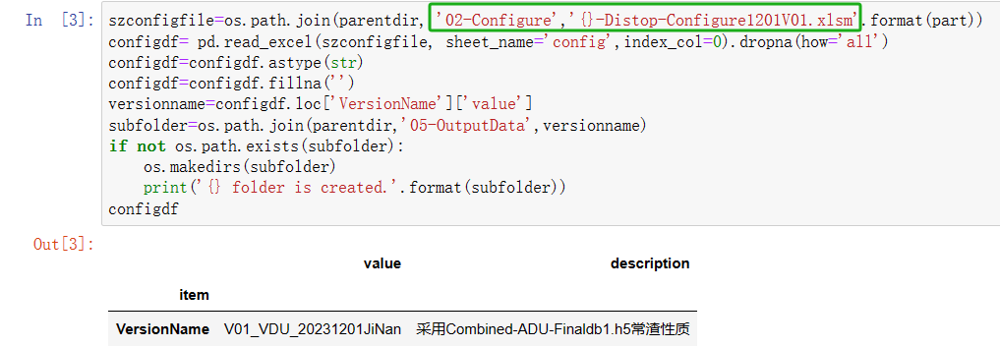

- 把复杂的工作流程用自动化的、不易出错的脚本来代替
	- 集成环境
	- 直接看结果
- **Jupyter Notebook将Python的交互式特点发挥到了极致**
	- [[#green]]^^分析和建模^^是非常#碎片化 的工作，而每一块的碎片又有着非常强的独立性，甚至可以说除了数据本身之外，每一块的代码之间并没有很强的关联性。
	- [[#green]]^^数据分析和处理^^的过程往往是一个不断试验的过程，我们需要一次又一次的改变预处理的方式、尝试不同的特征工程处理、一遍又一遍的调整着模型参数等等等等。
	- 每一部分的工作都需要反复试验反复修改，而下一模块需要用到的只不过是上一模块输出的数据。
	- *在Jupyter当中，我们可以每写几行或者每完成一个小的模块便运行一次；通过Jupyter，我们可以最快的得知自己做出的调整是好还是坏，并尽快进入到下一次的试验当中。*
	  background-color:: blue
- **Jupyter Notebook更利于汇报和教学**
	- Jupyter在工作汇报和教学方面也是非常的优秀。由于Jupyter本身的模块化和内容的清晰化，使得其天生具有如PPT一般的展示工作成果的功能。
	- 由于Jupyter中可以将输出结果嵌套在Notebook中，并且支持Markdown语句的操作，这样使得你可以在Jupyter中输入任何你需要展示的内容，并且这些内容都会以一种[[#blue]]^^有组织有层次^^的样子排列出来。
- **00-Generate Crude Property Based on Configuration.ipynb**
	- config [[配置表]]
	  id:: 6576b390-9fbf-4294-b228-b1f18a2c12f3
		- 版本名\rightarrow在outputdata中生成不同文件夹
			- 
	- crude propert 原油属性
		- refinery 样本
			- TBP curves
			- tag \leftrightarrow variable name
	- TBP conversion 定温累计收率
		- 混合规则
		- 基于收率\rightarrow基于温度
		- 非线性采样\rightarrow线性采样
	- cut point 理想收率
		- 理想馏分，连续切割
		- 估算现场切割点
	- sampling target property
		- Tag
		- varlist
		- Relaxcoef
		- formula
		- 样本数量
- **01-Crude Sampling.ipynb**
- **00-VDU Feed Sampling.ipynb**
	- objective:
	  抽样方法提取常渣进料样本
	  收率分布覆盖且吻合现场数据
	- basic principles：
	  每种原油有5~10个ADU重复样本——相同same/相似close
	  VDU与ADU方法相似
	  移除相似样本后，获得目标数量级常渣样本
	  开发了一种基于加权欧氏距离来去除重复样本的方法
	  所选属性包括31点TBP曲线点及API、流量等
	- 1.删除相似常渣样本数据
	- 2.比较删除前后分布变化
	- config[[配置表]]
		- mapping+描述
-