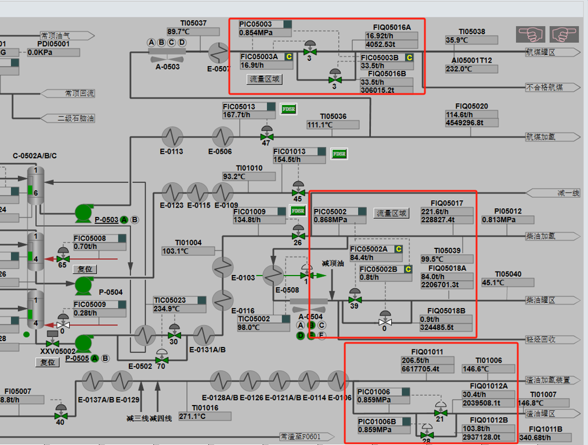
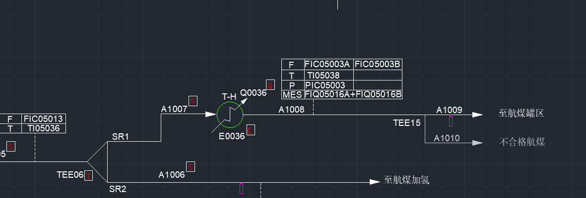
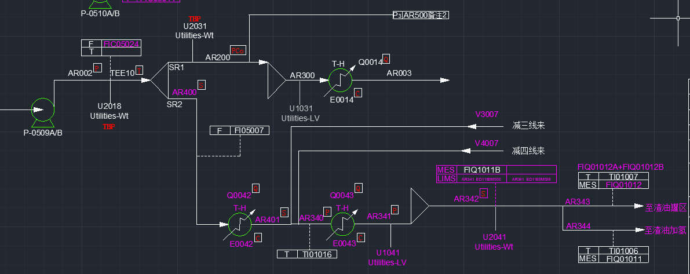

- #标准化
	- 
	  云南标准化取样位置是否根据《分析计划与指标》表对应的PID图纸中信息来确定？
	- 
	  脱前原油分支流股新增命名CB001、CB002合适吗？
	- 
	  一级PIC02001二级PIC02008(电脱盐压力)，怎么排布比较好？
	-  
	  初底油分支流量与四路合并后压力PIC01018串控，放在哪里比较好？
	  PR500为催化车间热联合换热前流股，新增PR500标准化命名合适吗？
	- 
	  PI03004是“出含硫污水冷却器压力”，与装置水平衡有没有关系？是否需要放在此处？
	  初顶瓦斯去向待确定，是与装置所有不凝气一同进双脱后出装置（DCS流程图中气体脱硫系统页面唯独没有初顶瓦斯，但技术规程里写了）还是去火炬线（DCS初馏塔页面）？
- 
  化验分析好像不测稳底石脑油性质，待确定
  污油信息在物料平衡里需要做吗？
	- **回复**：
	  1. 关于取样器，按照LIMS分表数据和《分析计划与指标》及PID一起确定；
	  2.CB001 CB002 可以
	  3.电脱盐压力可以在C1001上标注一级压力，DR001上标注二级压力。
	  4.PIC01018 根据PID上实际测量位置，放在在初底三支路换热后合并流股PR500。名称可以是PR500
	  5. PI03004 初含硫污水冷却器压力，与水平衡没有关系， 不需要放在这里，PTW01压力和DR002罐压力相同。
	  6.初馏塔提压操作，初顶瓦斯量很少，PID显示初顶瓦斯去向火炬气和脱硫系统，去脱硫的NNF正常无流量。我们暂时按照两个去向都画出，去脱硫的标注NNF即可。后续对装置的疑问整理到一块问车间即可。
	  7.稳底石脑油在LIMS里面有分析。分析计划与指标中只列出了常减压的分析。
	  8.轻、重污油暂定放在平衡表。
- #标准化
	-  
	  1.如上图所示：常底、常四、以及所有泵出口均对泵的最小流量设置了循环回流，当外送流量不超过泵的最小连续稳定流量时，投用回流；
	  泵后有一块FIC流量表，实际外送流量也有一块FIC表；
	  绘图的时候需要将回流和两块仪表都标识出来吗？例如下图对常四线的处理：FIC05006和FIC05014同时保留，还是仅保留FIC05006呢？
	  
	- 
	  2.如图所示，侧线产品于换热器出口分流成两条支路，其中部分流量调节与压力调节构成==C=="串控”，PID中标注该流程为“分程调节”，与APC有无关系，标准化流程图中需要标注出侧线产品的分流支路及压力吗？以常一线至罐区为例，目前我是合并在一起的：
	  
	- 3.新增常渣外甩流程，部分常渣与减三线减四线合并去渣油加氢；待确定流程——调研信息中：渣油加氢400万（焦化蜡油）双系列，宜焦
	  