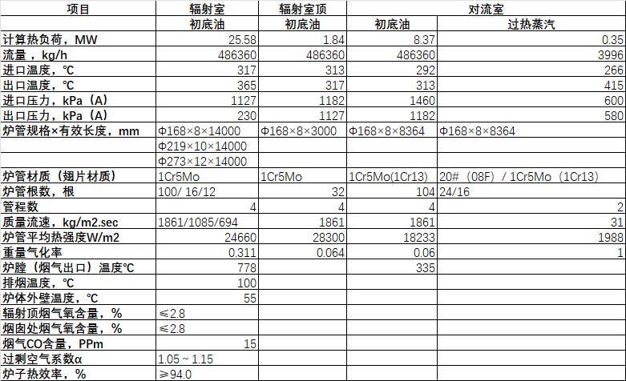
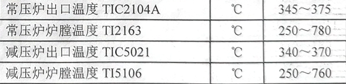
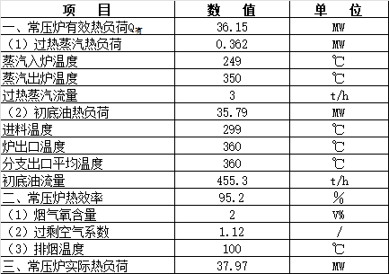
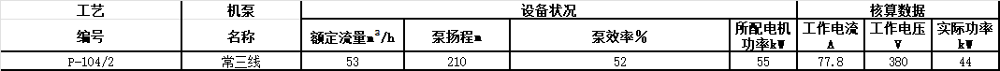
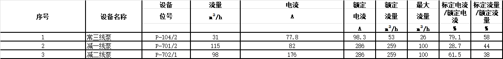
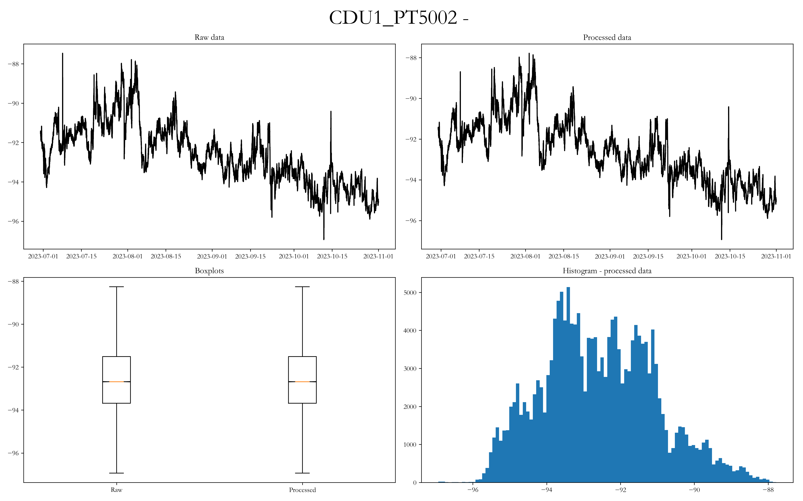

## 加热炉情况
collapsed:: true
	- **常压炉主要设计参数**
	  
	- ### 2021年根据装置优化节能调整，停运减压炉，减压系统及换热系统，能耗等有较大变化。
	- ### 2023年6月中下旬开工后减压炉启运，减压塔中段回流量较低，减压拔出率12.84%。
	- **设计关键参数为：**
	  原油换热温度299℃，电脱盐温度134℃，初馏塔进料温度222℃，常压炉出口温度360℃，减压炉出口温度370℃，减顶真空度-98.6KPa（按标准大气压101.3KPa计算，哈尔滨实际大气压夏季98.86KPa，冬季100.52KPa）。
	- **工艺卡片：**
	  `加热炉炉膛温度，炉出口温度及加热炉四路出口温度，加热炉排烟温度，氧含量，及烟气环保指标控制按照工艺卡片约束条件执行。`
	  
	- **常压炉核算数据表**
	  
	- **减压炉核算数据表**
	  
	- **常压炉设计热负荷34.5MW，最大热负荷可到40MW。**标定负荷下，进料温度299℃，炉出口温度360℃时，常压炉实际热负荷37.97MW，有效热负荷为36.15MW，辐射炉膛最高温度达到738℃，炉管初底油阻力降1.3MPa，排烟温度100℃，热效率为94.5％。常压炉设计时已考虑了多种介质多种工况的操作，操作弹性较大。
	- **减压炉设计热负荷14.2MW。**标定负荷下，进料温度348℃，炉出口温度355℃时，减压炉实际热负荷6.74MW，有效热负荷为6.2MW，辐射炉膛最高温度达到585℃，炉管初底油阻力降1.3MPa，排烟温度135.5℃，热效率为91.9％。
	- 
	- 
	- 减压塔顶压力随时间的变化规律：
	  
- ## [[技术交流]]思路
	- 针对企业各层级各部门、装置相关技术人员的需求和疑惑进行交流，建立吸引，目的是激发其兴趣和好奇心；
	- 全面熟悉和掌握哈尔滨石化常减压装置信息，明晰现场约束条件；
	- 了解企业加工原油的动态特性，基于当时的生产实际加工负荷及原油结构，可以加工出什么样的物料；
	- 充分展示工艺数字孪生技术在炼油行业应用的优势：实时模拟+通盘优化（优化思路及方法）；
	- 跟踪实验室分析检测项目、过程自动检测与控制技术；
	- 学会察言观色，根据现场环境灵活变通；
- ## 问题和同事建议
	- V1.0 **哈尔滨组内同事**
		- 对报告内容不够熟悉
		- 控制时长，讲太久容易犯困
		- 讲稿不如PPT
		- 找相宜姐要一版之前其他项目的完整交流材料
	- V2.0 **组内同事：小麦+一琳**
		- 不要作没得感情的讲稿机器，要学会带有感情色彩、熟悉并理解枯燥且官方的文案内容，转换成自己的语言绘声绘色地表达出来
		- 思路和逻辑需要进一步清晰，按总分总的框架去阐述
		- 目的是吸引听众，使其感兴趣
	- V3.0 **公司领导：王老师+欢欢姐+宋菲姐**
		- 产品特点➡产品功能
		- 花钱买服务➡产品可以为业主带来什么好处，了解企业需求并作出回应
		- 技术路线只做简要介绍，要考虑对方能不能理解具体的讲解内容，重点把握双方关注产品功能的异同点
		- 业主懂的东西不要多讲，简单一句话带过即可
		- 明确每页PPT要传达的观点，把表述的内容按照逻辑关系串联起来，理解性记忆并逐渐形成脱稿交流
		- 展示的文字描述不要放太多，从产品介绍粘过来的内容不要讲太多，看透本质，抓住重点即可
		- 关键的图表信息一定注意不要暴露问题，面对提问时要注意对方是在就事论事还是有言外之意，在不产生分歧的前提下交流
		- 根源在于：思考问题的深度和看待问题的角度；重组和优化幻灯片顺序，建立好信心再接再厉，继续练习