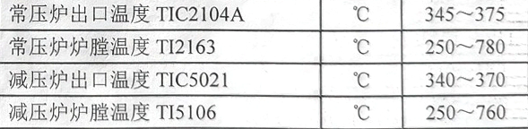
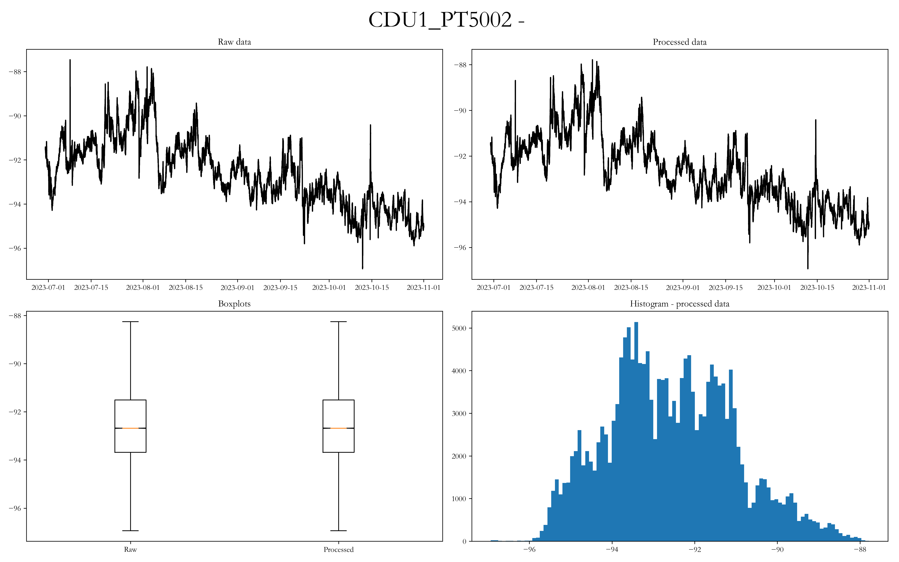

## 加热炉情况
	- 2021年根据装置优化节能调整，停运减压炉，减压系统及换热系统，能耗等有较大变化。2023年装置停工检修，6月中下旬开工后[[$red]]==减压炉启运==，减压塔中段回流量较低，减压拔出率12.84% 。
	- 设计关键参数为：原油换热温度299℃，电脱盐温度134℃，初馏塔进料温度222℃，常压炉出口温度360℃，减压炉出口温度370℃，减顶真空度-98.6KPa（按标准大气压101.3KPa计算，哈尔滨实际大气压夏季98.86KPa，冬季100.52KPa）。
	- **工艺卡片：**
	  
	- 减压塔顶压力随时间的变化规律
	   