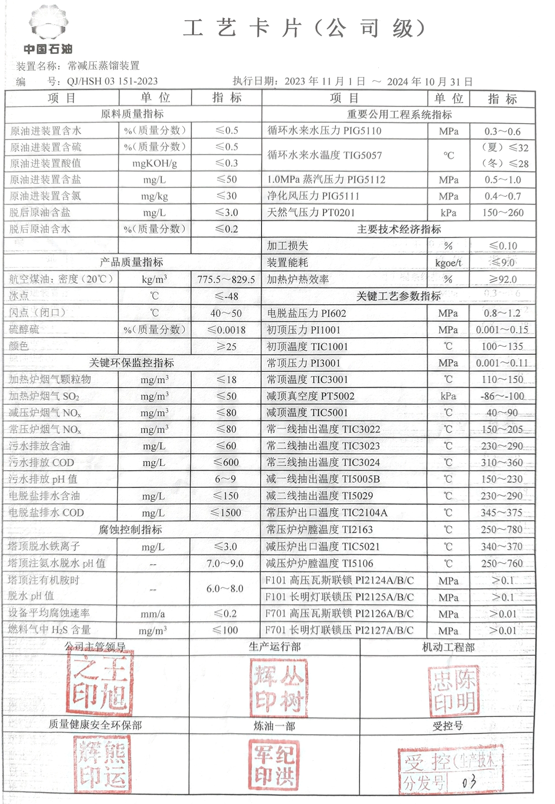
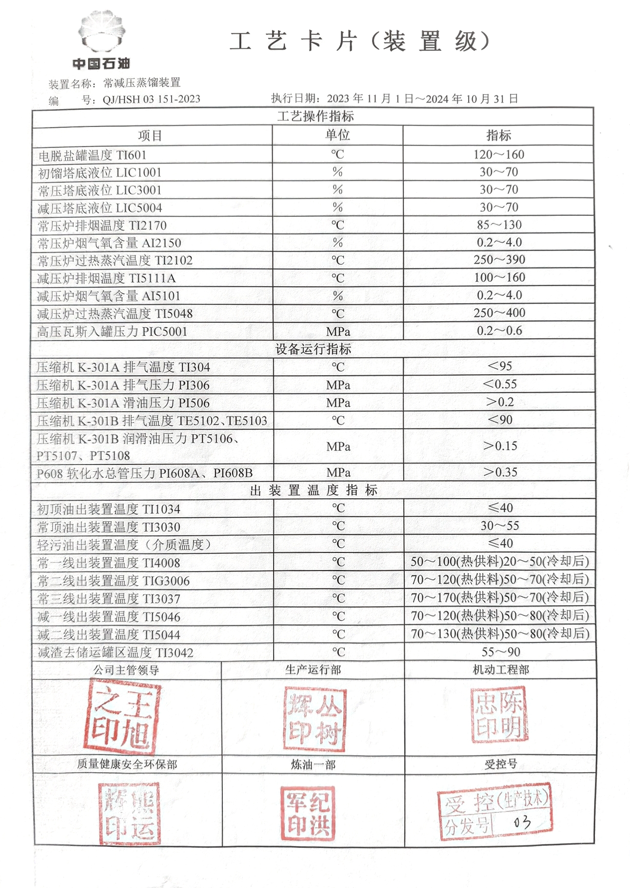
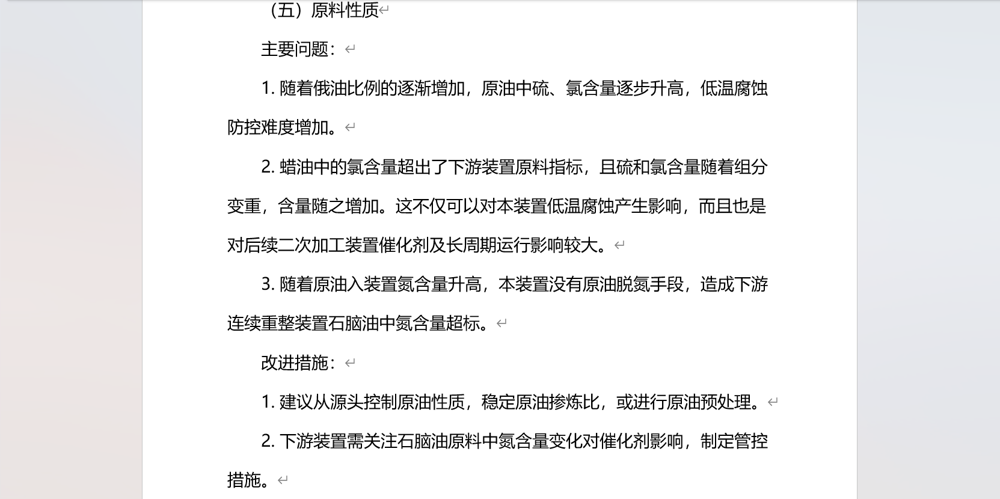
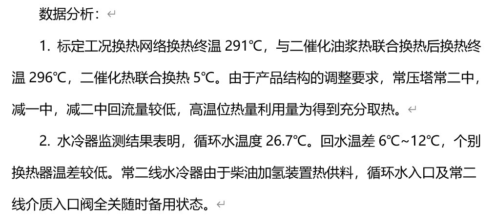

- 模拟所需资料
  collapsed:: true
	- 设备资料
	  collapsed:: true
		- 设备台账
		- 换热器设计规格书、档案
		- 空冷设计规格书、档案
		- 各塔详细设备图纸
		- 加热炉设计规格书、档案
		- 泵设计规格书、档案
		- 管道表
		- 转油线
		- 仪表设计规格书、档案
	- 日常生产操作记录
	- 装置能耗统计
	- APC相关资料
	- 全厂物料平衡图
	- 计划相关
		- 装置生产方案（加工原油，侧线产品去向，产品指标）的年度计划，月度计划（往后是否存在大的变动的可能？），典型生产方案执行时间段
	- 补充完善项目前期未收集的数据
	- 装置下次检修计划
	- 现场操作记录跟踪和数据采集
		- 和厂里协商确定工况变化比较大的时间
		- 在现场跟踪操作工操作
		- 实时数据补充采集
		- 整理数据对齐操作变化
	- 装置检修记录
- 装置信息提供资料
	- 物料8-10月数据
		- DOING 没有标定期间的物料平衡数据
		  id:: 658a36db-54fe-4329-a93e-076839ac5638
		  :LOGBOOK:
		  CLOCK: [2023-12-26 Tue 10:27:36]--[2023-12-26 Tue 10:28:06] =>  00:00:30
		  CLOCK: [2023-12-26 Tue 10:28:07]
		  :END:
	- 常减压7.8DCS截屏
		-
	- 2022原油评价报告
		-
	- 化验数据分析
		- 开始于2023-07-01
		- 初常顶石脑油
		- 电脱盐排水
		- 电脱盐前后原油
		- 瓦斯/天然气组成
		- DONE 化验分析只提供了初常顶石脑油、瓦斯天然气和原油相关部分数据
		  id:: 65893790-0042-4999-92cd-88fa68079e23
		  :LOGBOOK:
		  CLOCK: [2023-12-26 Tue 10:27:38]--[2024-01-17 Wed 09:51:26] =>  527:23:48
		  :END:
	- 工艺设备表2
		- 换热器设备型号/管壳程介质
	- 常减压装置特种设备总台帐(2021)
		- DONE 常压侧线汽提塔**C-103、104、105**均为填料塔，填料高度均为H=3m，塔板数给多少？
		  id:: 658a3cf3-0702-49b0-9c42-a48d4e0c8299
		  :LOGBOOK:
		  CLOCK: [2023-12-26 Tue 10:42:08]--[2024-01-17 Wed 09:51:37] =>  527:09:29
		  :END:
		  *含三套液体分配装置，三套驼峰式支撑结构*
			- 明确抽出/返回板：
			  id:: 658a4069-1960-495a-a34c-3d98fc7c5cf1
			  
			  常一线油，由常压塔40层塔板抽出；气相41板返回（7.8DCS截屏40板抽出）
			  常二线油，由常压塔26、28层塔板抽出；气相27板返回（7.8DCS截屏28板抽出）
			  常三线油，由常压塔12、14、16层抽出；气相15板返回（7.8DCS截屏16板抽出）
			  [[$red]]==侧线汽提气相返塔位置是否按操作规程附图确定？==
			  常一中油，由常压塔36层塔板抽出，39层塔板返回
			  常二中油，由常压塔22层塔板抽出，25层塔板返回
			-
	- 常减压装置操作规程2023
		- 2023年10月31日发布                2023年11月1日实施
	- 常减压装置标定报告2023
		- 2023年7月7日9：00 ～7月9日9：00
	- 2023-2024常减压装置工艺卡片
		- 
		- 
- 需要了解的主要问题
	- 原料性质
	  
	- 物料平衡
	  主要问题：加工损失较大，特别是电脱盐反冲洗过程中损失较大。
	- 主要换热器核算分析
	  
- 样本生成
  collapsed:: true
	- 挑战#challenges
	  collapsed:: true
		- 计算求解需要大量时间
		- 模拟软件存在可行域/偏好操作空间（造成局部最优解）
		- 收敛率低
			- 干板问题
				- 监控关键变量
					- 净液相量低的塔板
					- 关键操作条件
			- 参数突变
				- 聚类clustering
				- 序列sequence
			- 模拟环境
				- 退回上一步操作
				- 运行两遍塔
			- 能量平衡
				- 远离干板操作
	- 基于上述工业流程模拟软件的特点，形成的采样集成框架如下：
	  collapsed:: true
		- An intergrated Framework
		  id:: 6579146f-bb42-4fa3-9613-e63e6db2b0c4
		  集成[[框架]]
			- VDU Feed issue——用常渣作为进料
			  [[有序采样]]
			- Distop
				- → LHS独立变量输入
				- → 简洁模型输入input
				- → [[数据清洗]]、[[可视化]]分布对比
				- → 简洁模型模拟——现场数据约束
				- → GAMS优化减压塔进料温度
				- → 简洁模型二次模拟——样本修正+[[数据清洗]]
				- → 单变量+多变量[[分布检查]]
			- Rigorous
				- → 详细模拟输入input
				- → 样本聚类+排序
				- → 严格模型分步模拟
				- → [[数据清洗]]
			-