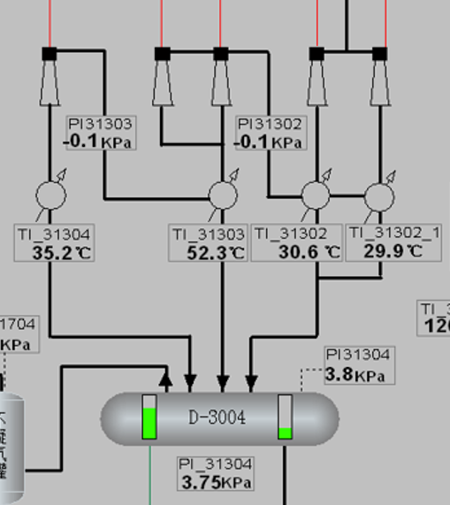

- #标准化 **减压炉出口温度位号[[$green]]==TIC31110==、[[$green]]==TI31109==、[[$green]]==TI31110==在标准化流程图中绘制的位置有待确认：**
  [[$green]]==TIC31110==和[[$green]]==TI31109==在DCS流程图中的位置关系是[[$red]]==减炉总出口温度==与[[$red]]==燃料气去减炉==阀位控制回路相关联的位号，[[$green]]==TI31110==在减炉界面位于二者之后，在减压塔界面[[$green]]==TI31110==表示进减压塔温度，其中[[$green]]==TIC31110==与[[$green]]==TI31110==数值相等，但[[$green]]==TI31110==温度较[[$green]]==TI31109==更高，三者在实时数据位号描述中均被称作“常底油出减压炉温度”
- 
  #标准化 三级抽真空系统需要标注哪些仪表位号？
  冷凝罐温度压力是否需要、